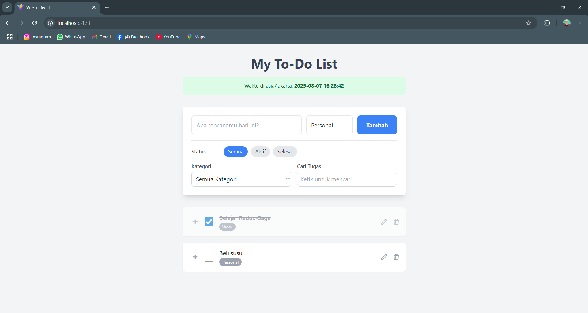

# Aplikasi To-Do List Interaktif (Prototipe)

Sebuah aplikasi to-do list prototipe yang kaya fitur, dibuat sebagai jawaban atas tantangan rekayasa frontend. Aplikasi ini dirancang untuk berfungsi sepenuhnya di sisi klien, menawarkan pengalaman pengguna yang modern, interaktif, dan responsif.



---

## ✨ Fitur Utama

-   **Manajemen Tugas (CRUD):** Tambah, Edit, Hapus, dan Tandai tugas sebagai selesai dengan antarmuka yang intuitif.
-   **Kategorisasi:** Kelompokkan tugas ke dalam kategori yang bisa dikustomisasi (misal: "Pekerjaan", "Pribadi", "Belajar").
-   **Filter & Pencarian Lanjutan:** Filter tugas secara real-time berdasarkan:
    -   Status (Semua, Aktif, Selesai)
    -   Kategori (dinamis berdasarkan tugas yang ada)
    -   Pencarian keyword pada teks tugas.
-   **Urutkan dengan Drag-and-Drop:** Atur ulang prioritas tugas dengan mudah menggunakan fungsionalitas drag-and-drop yang mulus dan aksesibel, ditenagai oleh `@dnd-kit`.
-   **Integrasi API Eksternal:** Menampilkan data dinamis dari API publik (misalnya, waktu dunia dari API-Ninjas) untuk memberikan nuansa hidup pada aplikasi.
-   **Animasi Loading:** Memberikan feedback visual yang jelas kepada pengguna saat aplikasi sedang mengambil data dari API.
-   **State Management Terpusat:** Menggunakan Redux Toolkit dan Redux-Saga untuk alur data yang predictable dan penanganan side-effects yang efisien.
-   **Desain Responsif:** Tampilan yang dioptimalkan untuk berbagai ukuran layar, dari desktop hingga mobile.

---

## 🛠️ Tumpukan Teknologi (Tech Stack)

-   **Library:** [React.js](https://reactjs.org/) (v19)
-   **State Management:** [Redux Toolkit](https://redux-toolkit.js.org/)
-   **Async Middleware:** [Redux-Saga](https://redux-saga.js.org/)
-   **Styling:** [Tailwind CSS](https://tailwindcss.com/) dengan [PostCSS](https://postcss.org/)
-   **Drag & Drop:** [@dnd-kit](https://dndkit.com/) - Library drag-and-drop modern dan aksesibel untuk React.
-   **HTTP Client:** [Axios](https://axios-http.com/)
-   **Build Tool:** [Vite](https://vitejs.dev/)
-   **ID Unik:** [UUID](https://www.npmjs.com/package/uuid)

---

## 🚀 Panduan Instalasi dan Menjalankan

Ikuti langkah-langkah berikut untuk menjalankan proyek ini di lingkungan lokal Anda.

### Prasyarat

-   [Node.js](https://nodejs.org/en/) (v16 atau lebih baru)
-   [npm](https://www.npmjs.com/) atau [yarn](https://yarnpkg.com/)

### Langkah-langkah

1.  **Clone repositori ini ke mesin lokal Anda:**
    ```bash
    git clone https://github.com/MuhammadHudaibi/test-fujitsu.git
    cd test-fujitsu
    ```

2.  **Install semua dependencies yang dibutuhkan:**
    ```bash
    npm install
    ```
    _Atau jika Anda menggunakan yarn:_
    ```bash
    yarn install
    ```

3.  **Setup Environment Variables (Variabel Lingkungan):**
    Aplikasi ini memerlukan API Key dari [API-Ninjas](https://api-ninjas.com/api/worldtime) untuk fitur waktu dunia.

    -   Buat file baru bernama `.env` di root direktori proyek.
    -   Daftar untuk mendapatkan API Key gratis di situs API-Ninjas.
    -   Tambahkan kunci Anda ke dalam file `.env` dengan format berikut (sesuaikan prefix berdasarkan build tool Anda):

    **Untuk proyek Vite:**
    ```
    VITE_API_NINJAS_KEY=KunciAPINinjasAndaDiSini
    ```

    **Untuk proyek Create React App:**
    ```
    REACT_APP_API_NINJAS_KEY=KunciAPINinjasAndaDiSini
    ```

4.  **Jalankan server development:**
    ```bash
    npm run dev
    ```
    _Atau jika Anda menggunakan yarn:_
    ```bash
    yarn dev
    ```

5.  Buka browser dan navigasikan ke `http://localhost:5173` (untuk Vite) atau `http://localhost:3000` (untuk CRA), atau port lain yang ditampilkan di terminal Anda.

---
